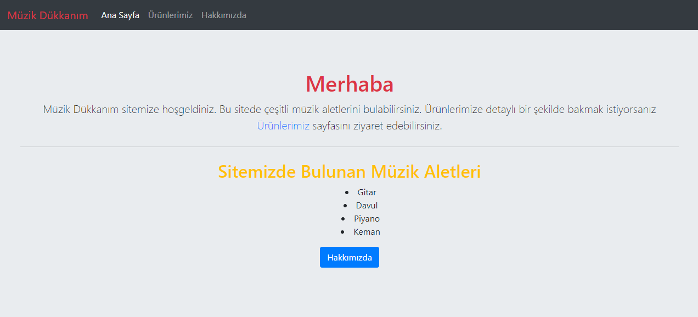

# Patika.dev Front-end Eğitimdeki İlk Bootstrap Ödevi

**Css olarak sadece arkaplan renk değiştirme ve liste noktalarını ortalama amaçlı inline css kullanılmıştır. Kalan tüm stillendirmeler Bootstrap ile yapılmıştır.**

## Örnek bir tasarım bulunması açısından ana sayfa şu şekilde görünmektedir:

## Kullanılan VS Code Eklentileri:
* JS-CSS-HTML Formatter
* Live Server
* Material Icon Theme